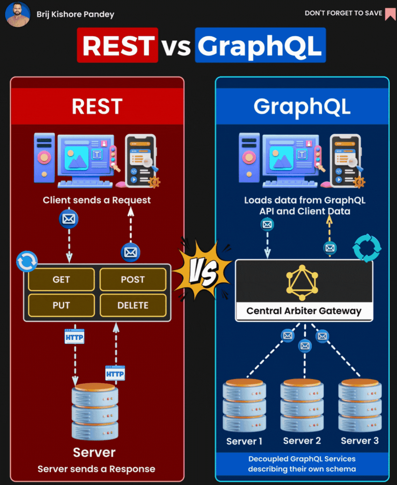

# REST API and GraphREST (Representational State Transfer) and GraphQL are two popular approaches to designing APIs.

Both have their own strengths and weaknesses, and the best choice for a particular project will depend on a variety of factors.

🔹 𝗥𝗘𝗦𝗧 (𝗥𝗲𝗽𝗿𝗲𝘀𝗲𝗻𝘁𝗮𝘁𝗶𝗼𝗻𝗮𝗹 𝗦𝘁𝗮𝘁𝗲 𝗧𝗿𝗮𝗻𝘀𝗳𝗲𝗿) 𝗔𝗣𝗜:

- 𝗔𝗿𝗰𝗵𝗶𝘁𝗲𝗰𝘁𝘂𝗿𝗲: REST is an architectural style that uses standard HTTP methods like GET, POST, PUT, DELETE.

- 𝗘𝗻𝗱𝗽𝗼𝗶𝗻𝘁𝘀: Each resource (like a user or a post) typically has a dedicated endpoint.

- 𝗢𝘃𝗲𝗿-𝗳𝗲𝘁𝗰𝗵𝗶𝗻𝗴/𝗨𝗻𝗱𝗲𝗿-𝗳𝗲𝘁𝗰𝗵𝗶𝗻𝗴: One of the challenges is that you might get more data than you need (over-fetching) or less than required (under-fetching).

- 𝗩𝗲𝗿𝘀𝗶𝗼𝗻𝗶𝗻𝗴: Changes often require versioning, leading to endpoints like /𝚟𝟷/𝚞𝚜𝚎𝚛𝚜 or /𝚟𝟸/𝚞𝚜𝚎𝚛𝚜.

🔹 𝗚𝗿𝗮𝗽𝗵𝗤𝗟:

- 𝗤𝘂𝗲𝗿𝘆 𝗟𝗮𝗻𝗴𝘂𝗮𝗴𝗲: GraphQL is a query language for your API, not an architectural style.

- 𝗦𝗶𝗻𝗴𝗹𝗲 𝗘𝗻𝗱𝗽𝗼𝗶𝗻𝘁: Typically, there's one endpoint that you send all your queries to.

- 𝗙𝗹𝗲𝘅𝗶𝗯𝗶𝗹𝗶𝘁𝘆: Clients can request exactly the data they need, no more, no less.

- 𝗦𝘁𝗿𝗼𝗻𝗴𝗹𝘆 𝗧𝘆𝗽𝗲𝗱: It's self-documenting and type-safe, ensuring data consistency.

- 𝗗𝗲𝗽𝗿𝗲𝗰𝗮𝘁𝗶𝗼𝗻 𝗼𝘃𝗲𝗿 𝗩𝗲𝗿𝘀𝗶𝗼𝗻𝗶𝗻𝗴: Instead of versioning, fields can be deprecated, making evolution smoother.

By: [Brij kishore Pandey](https://www.linkedin.com/in/brijpandeyji?miniProfileUrn=urn%3Ali%3Afs_miniProfile%3AACoAAAKDuMsBugjGZwz0pJy43LJ-6bVwc0gm9xQ&lipi=urn%3Ali%3Apage%3Ad_flagship3_feed%3BQtSvZDdGRWC1sP0wALThFQ%3D%3D)