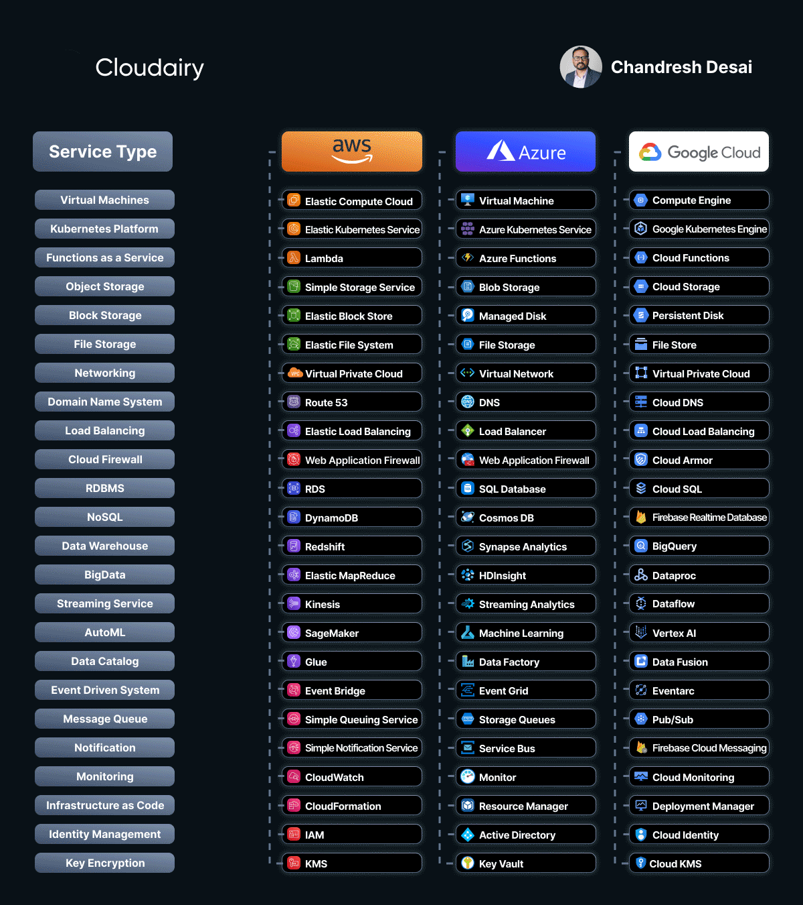

🚀 Choosing the Right Cloud Service: A Quick Comparison Cheat Sheet 🚀

In today's tech-driven world, selecting the perfect cloud service can be a game-changer for your business. 🌐

To make your decision a bit easier, I've put together a quick comparison cheat sheet of some popular cloud providers: Amazon Web Services (AWS), Microsoft Azure, and Google Cloud Platform (GCP). 📊

🔹 Scalability:

AWS: Renowned for unparalleled scalability, offering a wide range of services like Amazon EC2 and Auto Scaling.

Azure: Provides scalability options with virtual machines and Azure Autoscale.

GCP: Offers automatic scaling through Google Compute Engine and managed instance groups.

🔹 Service Variety:

AWS: Features an extensive service catalog, encompassing computing, storage, databases, and AI/ML.

Azure: Offers a rich services lineup with strong integration for Windows-based applications.

GCP: Stands out with unique services like BigQuery for data analytics and TensorFlow for AI applications.

🔹 Global Reach:

AWS: Maintains a widespread presence across most regions worldwide, ensuring low-latency services.

Azure: Boasts a strong global presence with data centers in multiple countries.

GCP: Expanding its network of data centers to enhance global coverage.

🔹 Pricing Model:

AWS: Offers pay-as-you-go and customizable pricing plans to suit your needs.

Azure: Provides flexible pricing options, including hybrid benefits for existing Microsoft users.

GCP: Offers transparent pricing with per-second billing and committed use discounts.

🔹 Security:

AWS: Boasts robust security features and compliance certifications to protect your data.

Azure: Integrates security tools like Azure Active Directory and advanced threat protection for enhanced safety.

GCP: Provides built-in security and encryption services, with a strong emphasis on data protection.

Remember, the best choice depends on your specific needs and goals. Take a deep dive into each provider's documentation to find the perfect fit.

Feel free to reach out if you have any questions or need more insights! Let's conquer the cloud together! ☁️

By: [Chandresh Desai](https://www.linkedin.com/in/chandreshdesai?miniProfileUrn=urn%3Ali%3Afs_miniProfile%3AACoAAANM5ToBl_yn1AYy12A2ZkuNFAMfVTgp2Q4&lipi=urn%3Ali%3Apage%3Ad_flagship3_feed%3BLfAqEYzVT1%2BIqfbkEC3LSA%3D%3D)