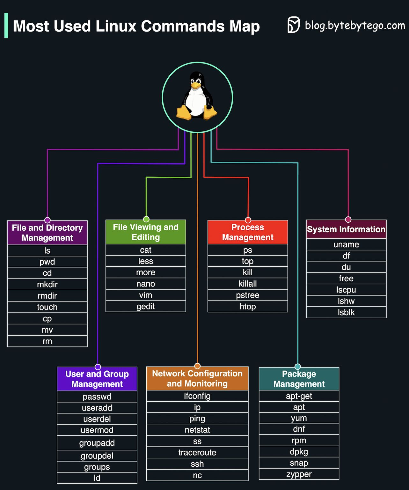

# Most Used Linux Commands Map

1. File and Directory Management
2. File Viewing and Editing
3. Process Management
4. System Information
5. User and Group Management
6. Network Configuration and Monitoring
7. Package Management

By: [Alex Xu](https://www.linkedin.com/in/alexxubyte?miniProfileUrn=urn%3Ali%3Afs_miniProfile%3AACoAAAJcVUEBpKxeVUb94KnEePlKepfIXeP2RM0&lipi=urn%3Ali%3Apage%3Ad_flagship3_feed%3BBxWcluFSTwi6YTKY%2BRtZBw%3D%3D)